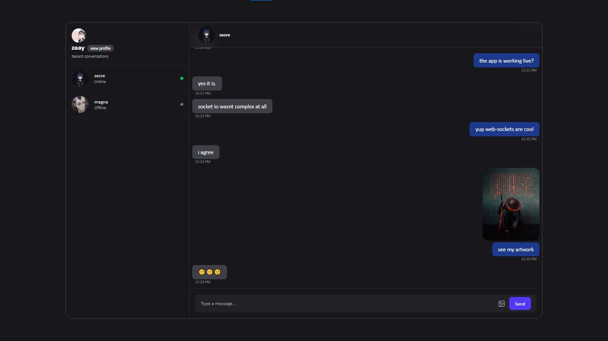

# Simple Real-Time Chat App 💬⚡

A simple **real-time chat application** built using the **MERN stack**, focused mainly on understanding **websockets** and how **real-time systems work**.  
Authentication is handled using **JWT (session-style via cookies)** and messaging is powered by **Socket.IO**.

---

## 📸 Screenshots

---

## ⚙️ Tech Stack

### Frontend 🎨
- React (Vite)
- Tailwind CSS
- Socket.IO Client
- Zustand (state management)

### Backend 🧠
- Node.js
- Express.js
- MongoDB
- Mongoose
- Socket.IO
- JWT Authentication (HTTP-only cookies)

### Cloud ☁️
- Cloudinary (image uploads using streams)

---

## ✨ Features

- 🔐 User authentication with JWT (session-based)
- 💬 Real-time one-to-one messaging using Socket.IO
- 🟢 Online / 🔴 Offline user presence
- 🖼️ Image sharing in chats
- ⚡ Instant UI updates without refresh

---

## 🚀 Learnings

My **main focus** was to understand **websockets** and how **real-time applications work** using a simple chat app.  
Along the way, I learned:

- 🔌 **Socket.IO**
  - Realtime client–server communication
  - UserId → socketId mapping
- 🔐 **JWT Authentication**
  - Session-style auth using HTTP-only cookies
- 🗂️ **Zustand**
  - Lightweight global state management
- 📤 **Frontend → Backend communication**
  - Sending files using `multipart/form-data`
- ☁️ **Efficient file uploads**
  - Buffer → Readable Stream
  - Streaming uploads to Cloudinary using `pipe()` for better performance
- 🧱 Clean separation of concerns (auth, messages, sockets)

---

## 🟢 Run This Project Locally

### 1️⃣ Clone the repository
- `git clone <repo-url>`
- `cd project-folder`

### 2️⃣ Setup Backend
- `cd backend`
- `npm install`

#### Create `.env` file (backend)
- `PORT=4001`
- `SERVER_ENV=development`
- `FRONTEND_URL=http://localhost:5173`
- `JWT_SECRET=your_jwt_secret`
- `MONGODB_URI=your_mongodb_uri`
- `CLOUDINARY_CLOUD_NAME=your_cloud_name`
- `CLOUDINARY_API_KEY=your_api_key`
- `CLOUDINARY_SECRET_KEY=your_secret_key`

- Start backend server:
  - `npm run dev` or `npm start`

### 3️⃣ Setup Frontend
- `cd frontend`
- `npm install`

#### Create `.env` file (frontend)
- `VITE_BACKEND_URL=http://localhost:4001`

- Start frontend app:
  - `npm run dev`
